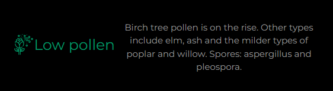

# MMM-UK-Pollen-Today

Displays the level of pollen for a region of the UK. Built as a module for [MagicMirror<sup>2</sup>](https://magicmirror.builders/)



## Notes

The basic implementation involves scraping the [UK Met Office pollen forecast](https://www.metoffice.gov.uk/weather/warnings-and-advice/seasonal-advice/pollen-forecast). The result is sanitised and parsed to display the forecast today with a list of airborne allergens. The module is inactive between October and Feburary as we are out of pollen season.

Be warned. An update to the UK Met Office site layout could break this module.

I am not currently planning any additional functionality as it was built primarily for my own mirror. The customisation is fairly limited, but can be adjusted to some degree using a `custom.css` file.

## Installation

Locate your modules directory and run the below command:

```sh
(git clone https://github.com/NashJames/MMM-UK-Pollen-Today && cd MMM-UK-Pollen-Today && npm i --omit dev);
```

## Default Config

```js
{
  module: "MMM-UK-Pollen-Today",
  position: "top_left",
  config: {
    region: 'se', // Region as defined on Met Office website. See table below.
    cronSchedule: '0 6 * * *', // Fetch frequency (https://cron.help/#0_6_*_*_*)
    showAirborneAllergens: true, // Display airborne allergens list
    colours: { // Icon & text colour customisation
      NONE: '#333333',
      LOW: '#009966',
      MODERATE: '#ffde33',
      HIGH: '#ff9933',
      VERY_HIGH: '#cc0033',
      NO_DATA: '#ffffff',
    },
  },
},
```

> [!IMPORTANT]
> Be careful Increasing tbe fetch rate significantly as you may incur rate limiting or an IP ban from the UK Met Office.

### Regions

| Code | Region                                |
| ---- | ------------------------------------- |
| os   | Orkney & Shetland                     |
| ta   | Central, Tayside & Fife               |
| he   | Highlands & Eilean Siar               |
| gr   | Grampian                              |
| st   | Strathclyde                           |
| dg   | Dumfries, Galloway, Lothian & Borders |
| ni   | Northern Ireland                      |
| wl   | Wales                                 |
| nw   | North West England                    |
| ne   | North East England                    |
| yh   | Yorkshire & Humber                    |
| wm   | West Midlands                         |
| em   | East Midlands                         |
| ee   | East of England                       |
| sw   | South West England                    |
| se   | London & South East England           |

## Acknowledgements

- [MMM-UK-Pollen-Forecast](https://github.com/szech/mmm-uk-pollen-forecast)
- [Pollen Icon (by Tippawan Sookruay)](https://thenounproject.com/icon/pollen-3924343/)
